# ARCHITECTURE_REVIEW.md — editor_v4 (P1, CORE-ONLY SCOPE v4.1)

> وثيقة المرحلة P1. لا حقول حالة هنا (SECTION 0.7) — الحالة في PROGRESS.md فقط.
> النطاق محكوم بـ SECTION 0.8: النظام الأساسي فقط. `providers/` مجلد مستبعد
> يُذكر في خريطة المستودع كعقدة خارجية مطوية ولا يُقرأ أو يُحلَّل.

---

## Reading Declaration (READING STRATEGY compliance)

| File / Area | Depth | Evidence basis |
|---|---|---|
| `server.py` (2,613 lines) | READ IN FULL — direct read L1–610, L608–968, L1076–1250, L1253–2613; L968–1075 (`api_models`/`api_switch_model`) skipped as OUT-OF-SCOPE provider-routing endpoints (existence recorded only) | C2 |
| `actions/file_manager.py` (317) | READ IN FULL | C2 |
| `actions/response_parser.py` (253) | READ IN FULL | C2 |
| `actions/command_runner.py` (258) | headers + `DANGEROUS_COMMANDS` + `run()` signature read; body skimmed | C2/C3 |
| `actions/session_manager.py` (189) | interface read (all method signatures) | C3 |
| `static/app.js` (3,723) | key flows read in full: `initWebSocket` L143–170, `handleWSMessage` L179+, `sendMessage` L785–830, `appendStreamChunk` L928–962, `finalizeStreamMessage` L964+; rest SKIMMED | C2 on cited flows, C3 elsewhere |
| `context/` (facade, engine, budget, safe_reader) | facade read L1–60; engine/budget/safe_reader interfaces read | C2/C3 |
| `chain/` (path_policy full; bridge/executor/agent_loop interfaces) | path_policy READ IN FULL (L1–60); bridge.py 785 / executor.py 599 / agent_loop.py 585 SKIMMED (class/method inventory) | C2/C3 |
| `core/` (app_context, execution, session_context, events, backends) | interfaces + docstrings read | C3 |
| `runners/`, `worker.py`, `sessions/`, `prompts/templates.py` | interfaces read | C3 |
| `config.yaml` (191 lines) | top-level keys enumerated (values not copied) | C2 |
| `static/js/` (6 modules), `static/vendor/` | inventory only | C3 |
| `tests/` (103 .py files) | inventory only | C3 |
| `providers/` (11 files) | **NOT READ — OUT OF SCOPE (0.8)** | — |
| `test---results/` | NOT read in P1 (P2/P6 evidence only per policy) | — |

---

## (a) Repo Map & Module Responsibilities

المجلد "major" إذا احتوى كودًا مُنفَّذًا أو تهيئة. المكتبات الـ vendored مُدرجة فقط.

| Path | Major? | Responsibility | Citation |
|---|---|---|---|
| `server.py` | ✅ | نقطة الدخول: Flask + flask_sock، REST API (~30 endpoint)، معالج WS، composition root (`main()`), إرسال الإطارات | server.py:L27–91 (imports/app), L2326–2609 (`main`) |
| `worker.py` | ✅ | وضع dispatch=worker: `Worker` (منفّذ عبر Redis queue) + `WorkerDispatchClient` (عميل التفويض بنفس توقيع Runner) | worker.py:L95 (`resolve_dispatch_mode`), L174 (`Worker`), L293 (`WorkerDispatchClient`) |
| `actions/` | ✅ | `FileManager` (قراءة/كتابة ذرّية/باك-أب)، `ResponseParser` (استخراج FILE/EDIT/CMD/OPTIONS)، `CommandRunner` (تنفيذ أوامر بموافقة/إعادة محاولة)، `SessionManager` (جلسات JSON) | file_manager.py:L37, response_parser.py:L65, command_runner.py:L44, session_manager.py:L16 |
| `core/` | ✅ | البنية التحتية المشتركة: `AppContext`/`ProjectHandle` (composition root، مقابض قابلة للإبطال)، `ExecutionRegistry`/`RunTicket` (سياسة run واحد + إلغاء تعاوني)، `EventBus` + أحداث مكتوبة الأنواع، `SessionContext` (حالة لكل اتصال WS)، `ApprovalGate`، `CheckpointManager`، `ProjectMemoryStore`، backends seam | app_context.py:L44/L91, execution.py:L87/L203, events.py, session_context.py:L1–30, backends.py |
| `chain/` | ✅ | نظام السلسلة: `ChainBridge` (تشغيل/استئناف/إلغاء/تطبيق مُبوَّب)، `ChainExecutor` (تنفيذ خطوات)، `AgentLoop` (حلقة أدوات ≤6 تكرارات)، `SmartOrchestrator`+`RequestRouter` (تقدير تعقيد وتوجيه direct/chain/delegate)، `planner` seam، `plugin_registry`، `path_policy` (احتواء مسارات + denylist أسرار)، `action_applier` | bridge.py:L178, executor.py:L75, agent_loop.py:L25, path_policy.py:L14–60 |
| `context/` | ✅ | محرك السياق: `ContextEngine.gather` فوق مصادر (Mention/Keyword/Structure/Symbol/Semantic)، `gather_message_context` facade، `ContextBudget.pack` (ميزانية توكنز من config)، `SafeReader` (بوابة قراءة وحيدة + كشف أسرار بالإنتروبيا)، `ProjectIndex` (فهرس مقلوب + write-through hooks) | engine.py:L111–123, facade.py:L1–60, budget.py:L131, safe_reader.py:L97/L148, index.py |
| `runners/` | ✅ | عقد Runner موحّد: `DirectRunner`/`ChainRunner`/`AgentRunner`/`DelegateRunner` — كلها `run(request, ticket, sink)` | runners/*.py (direct.py:L47, chain.py:L49, agent.py:L62, delegate.py:L61) |
| `sessions/` | ✅ | `SessionStore` (سجل append-only + بصمة مشروع + فحص ربط `check_project_binding`)، `retention` (سياسة GC للـ runs)، `memory` | store.py:L84/L116/L183, retention.py:L37/L98 |
| `prompts/` | ✅ | `build_prompt(mode,…)` — قوالب plan/build/edit/chat + `get_system_prompt` | templates.py:L104–135 |
| `static/` | ✅ | الواجهة: `app.js` (WS client، دفق، بطاقات actions/plan، مرفقات)، `index.html` (510)، 6 وحدات js (status_chip, diff_panel, code_highlight, memory_panel, run_history, file_icons)، themes/icons | app.js:L143/L179/L785/L928 |
| `static/vendor/` | ❌ vendored | highlight.min.js + hljs-dockerfile.min.js — مُدرجة فقط | ls static/vendor |
| `tests/` | ✅ | 103 ملف: unit (52) / integration (26) / contracts / fakes / goldens / fixtures — بنية اختبار حقيقية قائمة | ls tests/* |
| `scripts/` | ✅ | بوابات جودة: `check.sh`, `lint_handler_state.py`, `coverage_ratchet.py`, أدوات ترحيل | ls scripts/ |
| `config.yaml` | ✅ | مفاتيح top-level: default_provider, project_root, language, auto_execute, backup_before_edit, max_context_files, agent, context_budget, context, session_binding, retention, planner, backend, dispatch, routing, providers — القيم غير منسوخة؛ قسما default_provider/providers يخصان الحدود الخارجية | config.yaml (grep keys) |
| `providers/` (11 files) | **OUT OF SCOPE** | حدود خارجية مغلقة — تُمثَّل كعقدة واحدة مطوية في خريطة الاعتماديات | 0.8 |
| `sessions/` (data dir), `data/`, `public/`, `src/` (index.tsx 1680B), `examples/`, `docs/`, `improvements/`, `agents_rules/`, `newskells/`, `prompts/` (templates) | جزئيًا | بيانات/وثائق/قواعد وكلاء — غير مُنفَّذة في مسار الخادم الأساسي (src/index.tsx غير مستورد من server.py) | grep imports |
| `test---results/`, `test-results/` | ❌ | أرشيف QA (سياسة عدم التلوث — فحص BUG-04 في P2) | 0.8 + SECTION 2 |
| `accounts_use_ai.json` | غير موجود بالمستودع | gitignored (.gitignore:L18) — ملف أسرار خارج النطاق | verified Session 1 |

---

## (b) Runtime Flows

### b.1 WebSocket lifecycle
1. **اتصال**: `sock.route("/ws")(ws_handler)` — تسجيل صريح بلا decorator (server.py:L2236؛ تعليق L2233–2235 يشرح سبب ذلك للاختبار).
2. **بناء الحالة**: `ws_handler` (L2213) ينادي `_build_session_context(ws)` (L1253–1282): ينشئ `EventBus` خاصًا بالاتصال + `_WSAdapter` (موقع `ws.send` الأوحد — L210–238، قفل `threading.Lock` حول الإرسال L233–238) + `SessionContext` يحمل نسخة من `chat_history` والجسور ومقبض المشروع.
3. **حلقة الاستقبال**: `while True: ws.receive()` → `json.loads` → `_handle_ws_message(ctx, sctx, data)` (L2217–2225). **الحلقة متزامنة**: أي معالجة طويلة داخل الـ handler تحجب استقبال الرسائل التالية — المسارات الثقيلة (chain/agent/delegate) تتفادى ذلك بإطلاق `threading.Thread` (L1469–1476, L1619–1623, L2127–2143) فتبقى الحلقة حرة (تعليق L1740–1742 يوثّق ذلك صراحة).
4. **إغلاق**: `finally: sctx.close()` (L2226–2229) — تنظيف idempotent.
- **Context drift (0.2)**: `_safe_ws_send` المذكور في CONTEXT **غير موجود** — خلفه المعماري هو `_WSAdapter._send` (L233) + `_json_sender` (L331–338). يُسجَّل Stale-Context في P2.

### b.2 AI request lifecycle (حتى الحدود الخارجية)
المدخل: إطار `{"type":"message"}` → `_handle_ws_message` L1845–1854 → `_dispatch_chat_message` (L1285–1711):
1. **كشف مسارات ذكي** (L1287–1377): regex على النص (اقتباسات/مسارات Windows/كلمات)؛ ملف مكتشف → يُقرأ حتى `MAX_SMART_FILE_SIZE` ويُحقن؛ مجلد مكتشف → إمّا تبديل فوري (النص = المسار فقط) أو تعليق الطلب في `pending_path_requests` (TTL 5 دقائق — L106–147) وإرسال `path_detected_options` وانتظار `confirm_path_action` (L1750–1798).
2. **جمع السياق**: `gather_message_context(sctx.fm.root, user_text, index=…)` (L1381) → ثلاثية (mentioned_files, user_text_with_files, project_context)؛ حقن بانر ربط الجلسة إن وُجد (L1391–1396).
3. **التوجيه** (L1401+): `request_router.route(...)` يقرر tier — `DIRECT`/`CHAINED`/`DELEGATE`؛ نشر `RoutingDecided` على الـ bus الرصدي (L1430). *(منطق اختيار المزود داخل الـ router = فرع خارج النطاق؛ هنا نوثّق قرار المسار فقط.)*
4. **التنفيذ** عبر عقد Runner موحّد `RUNNERS[strategy](**deps).run(request, ticket, sink)` (L305–311):
   - CHAINED → تذكرة "chain" + thread + `ChainRunner` (L1446–1477).
   - DELEGATE → تذكرة "delegate" + `DelegateRunner` (L1480–1504).
   - Agent path (كل الأوضاع الأربعة إذا `agent_tools` مفعّل — L1512–1624): تذكرة "agent"، `AgentLoop` (≤6 تكرارات، `approval_gate`)، ثم parse للرد الكامل → إطار `plan` أو `done`.
   - المسار المباشر (L1632–1711): `build_prompt(mode,…)` → تذكرة "direct" → `DirectRunner(stream_fn)` حيث `stream_fn = sctx.active_provider().stream(...)` (L1657) — **هذه هي نقطة الحدود الخارجية المغلقة**: الاستدعاء يُوثَّق ولا يُنزَل فيه (0.8). نظيرتها في مسار الـ Agent: `provider_pool.send_with_fallback` (L1524–1528) — حدود خارجية كذلك.
5. **ما بعد الرد**: إلحاق بالتاريخ + `parser.parse(full_response)` → بناء قائمة actions → إطار `plan` (لو mode ∈ plan/build/edit **و** توجد actions) وإلا `done` (L1698–1711). ملاحظة تُحال لـ P2/BUG-01: إطار `done` في وضع chat **يظل يحمل actions المُستخرَجة** (L1706–1711) والـ parser نفسه mode-agnostic (response_parser.py:L107–187).

### b.3 In-app streaming (server→frontend)
- خادم: `_RunnerWSAdapter.emit` يحوّل `run_output` → `{"type":"chunk","text":…}` (L294–295)؛ إطارات `start`/`done`/`plan`/`error` من مواقع الإرسال المذكورة أعلاه. كل الإطارات تمر: `_frame_publisher` → bus الاتصال → `_WSAdapter._send` (JSON, قفل, ابتلاع أخطاء) — L241–265, L233–238.
- واجهة: `handleWSMessage` (app.js:L179) switch على `type`؛ `start` → `startStreamingMessage`؛ `chunk` → `appendStreamChunk` (L928): مراكمة نص + `parseResponseChannels` (فصل thinking/result) + `renderMarkdown` + إبراز تدريجي بكاش LRU (`CodeHighlight.highlightContainer` L957) + auto-scroll؛ `done`/`plan` → `finalizeStreamMessage` (L964) + `showPlanCard`.
- إعادة الاتصال: `onclose` → `setTimeout(initWebSocket, 3000)` — ثابتة بلا backoff (L154–159)؛ `onmessage` ينفّذ `JSON.parse` بلا try/catch (L166–169) — يُحالان لـ P3.

### b.4 Session lifecycle
- إقلاع: `main()` يستعيد آخر جلسة أو ينشئ واحدة ويملأ `chat_history` (L2353–2369).
- لكل اتصال WS: `SessionContext` يُبذَر **بنسخة** من التاريخ (L1276) ثم يتباعد — عزل تبويبات (فلسفة T-048 موثقة في core/session_context.py:L1–30).
- REST: `/api/sessions` قائمة، `/api/session/<id>` تحميل (يعيد كتابة `chat_history` العالمي — L885–902)، `/api/session/new`، حذف، `/api/clear` (L858–867).
- ربط الجلسة بالمشروع: `/api/switch-project` (L1096–1189) يفحص `check_project_binding` (sessions/store.py:L116) بسياسة warn/fork/block من config (`_session_binding_policy` L1076–1093)؛ التبديل ذرّي عبر `ctx.switch_project()` مع إعادة توجيه الـ globals القديمة كـ aliases (L1148–1159)؛ التبديل ممنوع أثناء run نشط (409 — L1101–1108).

---

## (c) Context Builder & Context Engine
*(فرع اختيار المزود أينما ظهر = خارج النطاق — يُذكر كحدود فقط.)*

- **العقد**: `gather_message_context(project_root, user_text, index)` (context/facade.py:L1–60) يعيد `MessageContext` بثلاثية متوافقة مع goldens تاريخية؛ الترتيب [Mention → Keyword → Structure] + path-dedupe بمسح نظام ملفات واحد.
- **المحرك**: `ContextEngine(sources).gather(ContextRequest)` (engine.py:L111–123) فوق بروتوكول `ContextSource.collect` (L98–107)؛ `ProjectScan` يبني lookup بالاسم/الـ stem (L64–96).
- **المصادر**: MentionSource (حد `MAX_MENTIONED_FILES` + حقن legacy)، KeywordSource، StructureSource (`STRUCTURE_PATH`)، SymbolSource، SemanticSource (علم `context.semantic` من config — facade.py:L36–56).
- **الميزانية**: `ContextBudget.pack` (budget.py:L131) — model_window/reserved_output/safety_margin/chunk_token_budget من قسم `context_budget` في config (L169–173)، مع `CharsPerTokenEstimator` (L58). **ذات صلة مباشرة بـ BUG-03** (تحقق كامل في P2): توجد آلية ميزانية، لكن مسار الحقن المباشر في `_dispatch_chat_message` (قراءة ملف مكتشف حتى 100KB — server.py:L1332–1339) ومسار `attach` (15 ملفًا × 2000 حرف — L1786–1791) يمرّان خارجها ظاهريًا.
- **بوابة القراءة**: `SafeReader` (safe_reader.py:L148) هي مسار القراءة الوحيد داخل `context/` (بوابة grep في check.sh — موثقة في facade docstring)؛ تتضمن `sniff_secret_content` بإنتروبيا Shannon (L86–120) و`is_denied`.
- **الفهرس**: `ProjectIndex` يُبنى عند فتح المشروع ويُعلَّق على FileManager عبر `add_write_hook` (server.py:L520–540, file_manager.py:L44–54, L116–121) — طزاجة فورية بعد كل كتابة ذرّية.
- **حدود خارجية**: تقدير النافذة (`model_window`) يُضبط بقيم لها علاقة بالنموذج المستهدف — الضبط نفسه in-scope (config)، أما ملاءمته لمزود بعينه فخارج النطاق.

---

## (d) Parser + edit/plan/build Pipelines

### Parser (actions/response_parser.py — READ IN FULL)
- أنماط: ` ```FILE: path` (L70–73)، ` ```CMD` (L76–79)، ` ```EDIT: path` بصيغة `<<<< OLD / ==== / >>>> NEW` (L87–90)، `[OPTIONS]` (L99–105).
- **Fallback جوهري** (L131–169): إذا لم يُلتقط FILE/EDIT، أي بلوك كود عادي ` ```lang` يُحوَّل إلى: أوامر (لو lang ∈ bash/sh/cmd/…, سطرًا سطرًا — L152–160) أو ملف باسم مُخمَّن `_suggest_filename` (L163–169, L189–235: script.py/index.html/style.css/main.js…).
- **الـ parser mode-agnostic بالكامل**: `parse()` لا يستقبل mode إطلاقًا (L107). التمييز بين الأوضاع مسؤولية المستدعي (server.py:L1698). هذه هي البنية التي يقوم عليها ادعاء BUG-01 — التصنيف النهائي في P2.

### Pipelines
- **chat**: `build_prompt` يمرّر السؤال بسياق خفيف (templates.py:L127–130) → direct stream → parse → إطار `done` **مع actions** (server.py:L1706–1711).
- **plan/build/edit**: قوالب PLANNING/EXECUTION/EDITING (templates.py:L120–125) → نفس المسار → إطار `plan` عند وجود actions (L1698–1704) → الواجهة تعرض بطاقة خطة (`showPlanCard`) → المستخدم يوافق → `apply_action`/`apply_all_actions`/`execute_plan` (L1856–1925) → `_apply_single_action` (L2243–2280): **باك-أب كامل ZIP قبل أول تعديل في الـ batch** (L2253–2261، عبر `fm.create_full_backup` — file_manager.py:L213–236) ثم `create_file`/`edit_file`/`run_command`.
- **duplicate code موثّق**: كتلتا `apply_all_actions` (L1862–1893) و`execute_plan` (L1895–1925) متطابقتان تقريبًا سطرًا بسطر — يُسجَّل في (g) ويُحال لـ P3.
- **مسار chain**: `chain_message` (L1931–2002) → `ChainBridge.start_chain` (bridge.py:L300) → executor → `_gated_apply` (bridge.py:L501) عبر `ApprovalGate`؛ استئناف بعد انهيار: `resume_scan`/`resume_run`/`discard_run` (L2031–2076) فوق `list_resumable` (bridge.py:L413).
- **rollback**: `rollback_run`/`rollback_file` (L1816–1843) فوق `CheckpointManager` بتحقق hash قبل الاستعادة؛ REST قراءة فقط `/api/rollback/history|preview` (L798–831).

---

## (e) Security Boundaries, Backup, Config Loading, Error Handling

### Security
- **احتواء المسارات**: `FileManager._resolve` → `resolve_workspace_path(root, path, must_exist=False, allow_symlinks=False)` (file_manager.py:L265–267 → chain/path_policy.py:L51) — نقطة تحقق مركزية (containment + منع symlink).
- **denylist أسرار**: `is_secret_file` (path_policy.py:L25–49): .env*, id_rsa…, .pem/.key/…, مجلدات .aws/.ssh/.git/… — مطبَّقة في `_walk`/`_walk_for_backup`/`_build_tree` (file_manager.py:L250, L281, L300)؛ و`SafeReader.sniff_secret_content` بالإنتروبيا داخل context/.
- **أوامر**: `CommandRunner` بقائمة `DANGEROUS_COMMANDS` (command_runner.py:L37–42) وموافقة — **لكن** مواقع استدعاء عديدة تمرّر `need_approval=False` (`/api/run` L769، `/api/run-file` L1246، `_apply_single_action` L2275) و`auto_approve=True` عند الإنشاء (L538, L2351)؛ سياسة أوامر الـ agent من config (`command_policy_from` L2571). سطح REST بلا مصادقة (خادم localhost افتراضيًا — L2338). التقييم التفصيلي في P3h.
- **ApprovalGate**: نقطة الموافقة الوحيدة قبل كتابات السلسلة/الـ agent — interactive افتراضيًا، auto مع whitelist عند `auto_execute:true` (L2407–2424).
- **عزل الحالة**: `scripts/lint_handler_state.py` يمنع `global` في الـ handlers؛ check.sh يمنع `ws.send` خارج `_WSAdapter` (docstring L217).

### Backup
- لكل ملف: `create_backup` نسخة موسومة بالوقت في `.webdev_backups/` قبل الكتابة (file_manager.py:L197–211, write_file L96–97).
- كامل: `create_full_backup` ZIP في `.webdev_backups/full/` بحد 5 نسخ، يستثني الأسرار والملفات >5MB (L213–260).
- REST: `/api/backups` قائمة و`/api/restore/<name>` — **الاستعادة `zf.extractall(fm.root)` بلا فحص أعضاء الأرشيف** (server.py:L947–960) — يُحال لـ P3h (zip-slip).
- Checkpoints (طبقة ثانية): snapshots لكل run مع hash-verified restore + prune مربوط بالـ retention (L2500–2509).

### Config loading
- `_read_config` تسامحية (فشل ⇒ {}) (L2286–2293)؛ لكن أقسامًا حرجة صاخبة عمدًا: planner (L2443–2451)، routing thresholds (L2535–2542)، backend/dispatch (L157–175) — فشل إقلاع واضح بدل سلوك صامت خاطئ.
- **تكرار ملحوظ**: config.yaml يُفتح ويُقرأ ≥6 مرات منفصلة (L159–166, L2412–2417, L2444–2446, L2489–2491, L2539–2541, `_read_config`, `_session_binding_policy` L1083–1093) — يُسجَّل في (g).

### Error handling
- الأنماط السائدة: REST يعيد `{"ok":False,"error":…}` مع رموز HTTP؛ إرسال WS يبتلع الأخطاء عمدًا (L233–238)؛ خطافات الكتابة لا تُفشل الكتابة (file_manager.py:L117–121)؛ الكتابة ذرّية tmp+fsync+`os.replace` مع تنظيف عند الفشل (L103–113).
- مواضع ابتلاع واسع (`except Exception: pass`) في مسارات القراءة/الإرفاق (server.py:L1338, L1386–1389, L1975–1976, L2103–2118) — تُقيَّم في P3g.

---

## (f) Dependency Map

### Mermaid graph

```mermaid
graph TD
  subgraph Frontend
    APPJS[static/app.js]
    JSMODS[static/js/*: status_chip, diff_panel, code_highlight, memory_panel, run_history, file_icons]
  end
  subgraph Server
    SRV[server.py]
    WORKER[worker.py]
  end
  subgraph Core
    APPCTX[core/app_context]
    EXEC[core/execution]
    EVENTS[core/events]
    SCTX[core/session_context]
    APPROV[core/approval]
    CKPT[core/checkpoint]
    PMEM[core/project_memory]
    BACKENDS[core/backends]
    RUNNER[core/runner]
  end
  subgraph Chain
    BRIDGE[chain/bridge]
    EXECUTOR[chain/executor]
    AGENTLOOP[chain/agent_loop]
    ROUTER[chain/router + orchestrator + planner]
    PATHPOL[chain/path_policy]
    APPLIER[chain/action_applier]
    PLUGREG[chain/plugin_registry]
  end
  subgraph ContextPkg
    FACADE[context/facade]
    ENGINE[context/engine + sources]
    BUDGETC[context/budget]
    SAFER[context/safe_reader]
    PINDEX[context/index]
  end
  subgraph Actions
    FM[actions/file_manager]
    PARSER[actions/response_parser]
    CMDR[actions/command_runner]
    SESSM[actions/session_manager]
  end
  RUNNERS_D[runners/*]
  SESSIONS[sessions/store + retention + memory]
  PROMPTS[prompts/templates]
  PROV[(providers/ — OUT OF SCOPE, collapsed)]

  APPJS -- "WS /ws + REST /api/*" --> SRV
  APPJS --> JSMODS
  SRV --> APPCTX & EXEC & EVENTS & SCTX & APPROV & PMEM & BACKENDS
  SRV --> BRIDGE & ROUTER & APPLIER & AGENTLOOP & PLUGREG
  SRV --> FACADE
  SRV --> FM & PARSER & CMDR & SESSM
  SRV --> RUNNERS_D & PROMPTS & SESSIONS & WORKER
  SRV -. "opaque boundary" .-> PROV
  BRIDGE --> EXECUTOR & CKPT & APPLIER
  BRIDGE -. boundary .-> PROV
  AGENTLOOP -. boundary .-> PROV
  RUNNERS_D --> RUNNER
  FACADE --> ENGINE --> SAFER
  FACADE --> BUDGETC & PINDEX
  FM --> PATHPOL
  PINDEX --> FM
  APPLIER --> FM & CMDR & PARSER
```


### Adjacency table (in-scope edges; provider edges collapsed to one row)
| From | To | Evidence |
|---|---|---|
| static/app.js | server.py (WS `/ws`, REST `/api/*`) | app.js:L143–146; server routes L590–1247 |
| server.py | actions/* (FileManager, ResponseParser, CommandRunner, SessionManager) | server.py:L30–33 |
| server.py | context/facade (`gather_message_context`) | L42, L1381 |
| server.py | chain/* (bridge, delegate, orchestrator, router, action_applier, agent_loop, agent_tools, knowledge, plugin_registry, planner, routing_config) | L43–53, L2429–2548 |
| server.py | core/* (runner, approval, project_memory, execution, session_context, events, app_context, strategy, backends, checkpoint) | L47, L54–84, L157, L2504 |
| server.py | runners/* + worker (dispatch seam) | L63–66, L174–191 |
| server.py | sessions/store + retention | L398, L1129, L2488 |
| server.py | prompts/templates | L34 |
| actions/file_manager | chain/path_policy | file_manager.py:L13 |
| context/facade | context/engine + sources + semantic_source + budget | facade.py:L23–32 |
| context/* (all reads) | context/safe_reader | facade docstring L40–45 |
| context/index | actions/file_manager (write hooks) | server.py:L531–534 |
| chain/bridge | chain/executor + core/checkpoint + action_applier | bridge.py:L178–300 |
| chain/action_applier | actions/{parser, file_manager, command_runner} | server.py:L2551–2556 |
| runners/* | core/runner (contract) | runners/*.py imports |
| worker.py | core/backends_redis + core/runner | worker.py:L163–300 |
| **server.py / chain / runners** | **providers/ — OUT-OF-SCOPE boundary (single collapsed node)** | import sites server.py:L35–41, L49–51; call sites L1524–1528, L1657, L2371–2532 — cited, not descended |

لا اعتماد دائري بين الحزم في الحواف المرصودة أعلاه (server → chain → core/actions/context؛ context → actions عبر hook تسجيلي لا import عكسي؛ actions → chain/path_policy وحيدة الاتجاه). فحص أدواتي مؤكِّد مؤجل لـ P3m.

---

## (g) Risks — bottlenecks, duplication, debt, coupling, scalability

| # | Category | Finding | Citation | Handoff |
|---|---|---|---|---|
| g1 | Debt / God-module | server.py = 2,613 سطرًا يجمع routes + WS + composition root + frame helpers — أكبر سطح تغيير مشترك في النظام | server.py كاملًا | P3l/P4 |
| g2 | Duplication | كتلتا `apply_all_actions` و`execute_plan` شبه متطابقتين | L1862–1893 vs L1895–1925 | P3l |
| g3 | Duplication | `MAX_SMART_FILE_SIZE` معرَّف مرتين | L128, L2240 | P3l |
| g4 | Duplication | config.yaml يُقرأ ≥6 مرات بمقاطع inline متكررة | L159, L1083, L2412, L2444, L2489, L2539 | P3l |
| g5 | Coupling / dual-state | REST endpoints تعمل على globals (`fm`, `cmd_runner`, `chat_history`) بينما WS يعمل على `SessionContext` لكل اتصال — تبديل مشروع من REST يغيّر عالميًا ومن WS يغيّر للتبويب فقط (سلوك موثَّق عمدًا لكنه سطح التباس) | L119–124, L1096–1189 vs session_context.py:L14–27 | P3a/P3f |
| g6 | Bottleneck | حلقة `ws_handler` متزامنة — أي handler بطيء غير مُخيَّط يحجب الاتصال (المسارات الثقيلة مُخيَّطة، لكن `apply_all_actions` مثلًا يعمل داخل الحلقة) | L2217–2225, L1862–1893 | P3a |
| g7 | Bottleneck | `api_search` يقرأ محتوى كل ملف نصي تسلسليًا لكل استعلام (حتى 10,000 ملف scan) | L609–667 | P3k |
| g8 | Security debt | `zipfile.extractall` في الاستعادة بلا فحص أعضاء؛ `need_approval=False` في مواقع تنفيذ الأوامر؛ REST بلا auth | L947–960, L769, L1246, L2275 | P3h |
| g9 | Scalability | حالة عملية-واحدة (registry/bus في الذاكرة افتراضيًا) — درزة backend/dispatch (memory/redis, in-proc/worker) موجودة أصلًا كمسار توسع | L157–175, worker.py | P7 |
| g10 | Frontend resilience | إعادة اتصال WS بثابت 3s بلا backoff/jitter؛ `JSON.parse` بلا حماية في `onmessage` | app.js:L154–169 | P3e/P3g |
| g11 | Contamination control | `IGNORE_DIRS` تضم `test-results` وليس `test---results` وكلاهما موجود بجذر المستودع | file_manager.py:L27–31 | **P2d (BUG-04)** |
| g12 | Duplication (none-found note) | لا duplication إضافي جوهري وُجد في actions/ وcontext/ بعد قراءتهما (نطاق البحث: الملفات المقروءة بالكامل أعلاه) | — | — |

---

## Checkpoint DoD note
كل الفقرات (a)–(g) أعلاه مشفوعة باقتباسات ملف:دالة:سطر فعلية من هذه الجلسات؛ الملفات الـ skimmed مُعلنة في جدول Reading Declaration؛ `providers/` مُعلن كمجلد مستبعد ولم يُقرأ.
